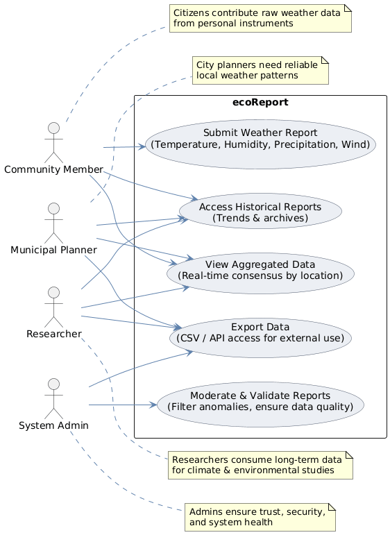

# Specification Phase Exercise

A little exercise to get started with the specification phase of the software development lifecycle. See the [instructions](instructions.md) for more detail.

## Team members

- [Avi Herman](https://github.com/avih7531/)
- [William Chan](https://github.com/wc2184/)
- [Jaylon McDuffie](https://github.com/treejitsu)

## Stakeholders
Ella K
Lily P

We gave all stakeholders an informal interview, asking them about their thoughts on our app and what they could use it for.  

## Goals or Needs
Ella is a grad student who regularly goes outside for jogging or walking her companion animals. Considering how active her lifestyle is, she would need to know about weather conditions like rain or sunshine to be safe. 

Lily is a senior majoring in Biology who has a great interest in gardening. In fact, she is the President of NYU's community garden, a little behind the Bobst Library. As an avid gardener, Lily needs to know about weather conditions like temperature, rainfall, and sunshine. That way, she can determine when to water or fertilize plants, how to protect plants from excessive cold or heat, and how to shield the garden against any harmful storms. 

Both students have share these goals:
- Check for weather-related hazards like slippery/icy roads, heat/cold waves, mud/land slides, flash floods, hail, fallen trees or obstacles, thunderstorms, hurricanes, or blackouts
- Know about weather conditions to make decisions/predictions for the day
- Be able to speak with and notify friends in the event of dangerous weather events
- Learn about and prepare for natural disasters or dangerous events
- Personally learn more about meteorology and the climate as part of citizen science
- Contribute to broader scientific research on global climate patterns and climate change 

## Problems or Frustrations
A lot of citizen science apps like iNaturalist do not directly address local weather or climate, although the non-living factors of the environment matter too. The recent Donald Trump administration has been cutting funding for scientific research in general, meaning less resources for meteorology/climatology. Knowledge about weather/climate, though, could help ordinary persons learn about and prepare for potential harmful events, whether they are full-blown natural disasters or simply days that are too hot/cold. Internet weather reports are intended for the broader community but may not be able to account for particular aspects such as electricity blackouts or downed trees. 

## Product Vision Statement

### Overview
Our vision is to develop ecoReport, a decentralized, community-driven weather reporting system that provides reliable and hyper-local environmental data in the absence of centralized federal resources. ecoReport empowers individuals to contribute observations from personal instruments, ensuring that accurate, real-time weather information remains accessible to the public.

### Motivations
ecoReport addresses the urgent need for dependable weather data when centralized systems are unavailable due to budgetary or infrastructural constraints. By crowdsourcing observations from citizens, the platform not only ensures continuity of essential information but also fosters community engagement, transparency, and trust. Hyper-local contributions provide finer granularity than traditional systems, creating a richer and more responsive picture of local weather conditions.

### User Focus
ecoReport is designed for simplicity and accessibility. Community members can input conditions such as temperature, humidity, wind, or precipitation using personal thermometers, hygrometers, or digital sensors. Reports are geotagged (via GPS or manual entry), validated, and aggregated into consensus-based forecasts. In return, users gain access to both raw and community-synthesized data, empowering them to make informed decisions about daily activities and safety.

### Business and Community Goals
The success of ecoReport is measured by its ability to:  
- Sustain public access to accurate weather data regardless of federal cuts.  
- Build a robust, engaged user base within the first six months.  
- Provide hyper-local insights to municipalities, schools, and individuals who rely on timely weather information
The platform will be mobile-first, scalable, and optimized for rapid updates so that contributions immediately enrich the dataset.

### Compliance and Accessibility
ecoReport is committed to protecting user privacy and data integrity. Only essential location data is captured, and reports are anonymized to prevent misuse. The platform adheres to international data protection standards (e.g., GDPR, COPPA) and follows accessibility guidelines (WCAG 2.1.), ensuring inclusive participation across communities.

### Security
Data integrity and user safety are central to ecoReport’s design. Validation mechanisms prevent false or malicious submissions, encryption safeguards reports in transit, and regularaudits ensure system resilience. Security practices are embedded throughout development and operations to maintain reliability and community trust.

### Conclusions
ecoReport envisions a future where communities independently sustain reliable weather reporting through collective participation. By uniting transparency, accessibility, and security in a user-friendly system, ecoReport ensures that the loss of centralized weather infrastructure does not compromise public access to critical environmental information

## User Requirements (User Stories)

1. As a new user, I want to create an account and log in so that my reports and history are saved.  
2. As a community member, I want to submit local weather data (temperature, humidity, wind, precipitation) so that I can contribute to the dataset.
3. As a community member, I want to participate in citizen science to help the broader community of scientific research.
4. As a user, I want to learn more about how weather works, the science behind it, and how to prepare for harmful or dangerous weather. 
5. As a contributor, I want to geotag my submission automatically or manually so that my report is tied to the correct location.  
6. As a user, I want to view aggregated local conditions so that I can see real-time weather in my area.  
7. As a traveler, I want to search conditions in a specific location so that I can prepare before leaving home.  
8. As a user, I want to filter reports by temperature, precipitation, or air quality so that I can focus on what matters to me.  
9. As a user, I want to receive alerts when severe conditions are reported nearby so that I can stay safe.  
10. As a community member, I want to see visualizations (maps, charts, trends) so that I can understand conditions at a glance.  
11. As a privacy-conscious user, I want my reports to be anonymized so that my identity is protected.  
12. As an admin, I want to flag and remove false or malicious submissions so that the dataset stays trustworthy.  
13. As an admin, I want to audit reports periodically so that the system remains resilient and accurate.  

## Activity Diagrams

## Wireframe

[Figma Wireframe Link](https://www.figma.com/design/CBcrUvf0P0AjIGfO3kpY9O/Project-1-Ecology?m=auto&t=aRhWSdAQKV0b5iXy-1)

## Clickable Prototype

[Clickable Prototype Link](https://www.figma.com/proto/CBcrUvf0P0AjIGfO3kpY9O/Project-1-Ecology?node-id=1-2&p=f&t=DYwkWsoryPR3VEp0-1&scaling=scale-down&content-scaling=fixed&page-id=0%3A1&starting-point-node-id=1%3A2)
